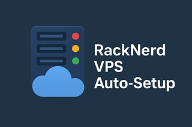

# 🚀 RackNerd VPS 自动化部署工具

一键配置 AlmaLinux 8 VPS，包含 Nginx、SSL、SFTP、WebDAV、Aria2、V2Ray、DDNS。

---

## ⚡ 快速开始

### 1. 准备

```bash
# 克隆项目
git clone https://github.com/holefrog/Racknerd.git
cd Racknerd

# 生成 SSH 密钥
mkdir -p rpi_keys
ssh-keygen -t rsa -b 4096 -f rpi_keys/id_rsa -N ""
ssh-copy-id -i rpi_keys/id_rsa.pub root@YOUR_VPS_IP
```

### 2. 配置

```bash
cp config.ini.example config.ini
nano config.ini
```

**最小配置：**

```ini
[ssh]
host=YOUR_VPS_IP
key=./rpi_keys/id_rsa

[nginx]
domain=example.com
email=admin@example.com

[ftp]
password=STRONG_PASSWORD    # openssl rand -base64 24

[aria2]
token=SECRET_TOKEN         # openssl rand -base64 32

[v2ray]
path_url=random_string     # cat /dev/urandom | tr -dc 'a-zA-Z0-9' | fold -w 16 | head -n 1

[webdav]
password=STRONG_PASSWORD
```

### 3. 部署

```bash
./setup.sh
```

**预计时间：** 10-15 分钟

### 4. 验证

```bash
# 使用新端口登录
ssh -i rpi_keys/id_rsa -p 22022 root@YOUR_VPS_IP

# 检查状态
./check_status.sh

# 访问网站
curl https://your-domain.com
```

---

## 🔧 基本操作

### Nginx

```bash
# 重启
systemctl restart nginx

# 测试配置
nginx -t

# 查看日志
tail -f /var/log/nginx/error.log

# 手动续期证书
certbot renew
```

**配置：** `/etc/nginx/conf.d/YOUR_DOMAIN.conf`

---

### SFTP

**连接：**

```bash
# 命令行
sftp -P 22022 ftpuser@YOUR_VPS_IP

# FileZilla
协议: SFTP
主机: YOUR_VPS_IP
端口: 同ssh
用户: ftpuser
密码: config.ini 中配置
```

**管理：**

```bash
# 修改密码
echo "ftpuser:NEW_PASSWORD" | chpasswd

# 查看日志
journalctl -u sshd -f | grep sftp
```

**优化（FileZilla）：**
- 并发连接：1-2 个

---

### WebDAV (⭐ 推荐)

**访问地址：** `https://your-domain.com/webdav`


**FileZilla：**
```
协议: WebDAV (HTTPS)
主机: your-domain.com
端口: 443
路径: /webdav
用户: webdav
密码: config.ini 中配置
```
**优化：** 并发连接 3-5 个

**Windows：**
```cmd
# 映射网络驱动器
net use Z: https://your-domain.com/webdav /user:webdav PASSWORD

# 解除 50MB 限制
reg add HKLM\SYSTEM\CurrentControlSet\Services\WebClient\Parameters /v FileSizeLimitInBytes /t REG_DWORD /d 4294967295 /f
net stop webclient && net start webclient
```

**macOS Finder：**
```
⌘ + K → https://your-domain.com/webdav
```

**Linux davfs2：**
```bash
sudo apt install davfs2
sudo mount -t davfs https://your-domain.com/webdav /mnt/webdav
```

#### 管理命令

```bash
# 添加用户
htpasswd -b /etc/nginx/.htpasswd_webdav username password

# 删除用户
htpasswd -D /etc/nginx/.htpasswd_webdav username

# 测试连接
curl -u webdav:password -X OPTIONS https://your-domain.com/webdav/ -v

# 健康检查
curl -k https://localhost/webdav-health
```

---

### Aria2

**访问：** https://ariang.mayswind.net/latest/

**RPC 配置：**
```
地址: https://your-domain.com:443/jsonrpc
协议: WebSocket (security)
方法: POST
密钥: config.ini 中的 aria2.token
```

**管理：**

```bash
# 重启
systemctl restart aria2

# 查看日志
tail -f /etc/aria2/aria2.log

# 查看下载
ls -lh /var/ftp/files
```

#### Aria2 + WebDAV 联动

**场景 1：远程下载 → 本地取回**

1. AriaNg 添加任务
2. Aria2 下载到 `/var/ftp/files`
3. WebDAV 取回文件：
```bash
curl -u webdav:password -o file.zip https://your-domain.com/webdav/file.zip
```

**场景 2：本地 Aria2 下载 VPS 文件**

```bash
# 安装本地 Aria2
sudo apt install aria2

# 配置本地 ~/.aria2/aria2.conf
http-user=webdav
http-passwd=webdav_password

# 下载
aria2c https://your-domain.com/webdav/path/to/file.zip
```

---

### V2Ray

#### 获取订阅配置

部署完成后，V2Ray 订阅文件会自动生成到 WebDAV 目录：

**方式 1：订阅链接（推荐）**
```bash
https://your-domain.com/webdav/v2ray_sub.txt
```
- 复制文件内容到客户端的订阅功能
- 如需查看原始配置：`cat v2ray_sub.txt | base64 -d > config.json`

**方式 2：二维码**
```bash
https://your-domain.com/webdav/v2ray_sub.png
```
- 使用客户端扫描二维码直接导入

**方式 3：手动配置**
```bash
# SSH 登录 VPS 后查看
cat /etc/v2ray/vmess_client.json
```

手动配置参数：
- 地址: YOUR_DOMAIN
- 端口: 443
- UUID: (自动生成，见配置文件)
- 传输协议: WebSocket (ws)
- 路径: /YOUR_PATH_URL
- TLS: 启用
- 伪装域名: YOUR_DOMAIN

---

#### Linux 客户端使用指南

##### 1️⃣ 安装 NekoRay（强烈推荐）

NekoRay 是 Linux 上体验最好的 V2Ray 客户端，功能完善，界面友好。

**特点：**
- 原生 Qt 界面
- 支持系统代理
- 内置分流规则
- 支持订阅更新

**安装方式：**

```bash
# Debian/Ubuntu 系统
# 下载 .deb 包
wget https://github.com/MatsuriDayo/nekoray/releases/latest/download/nekoray-*-debian-x64.deb

# 安装
sudo dpkg -i nekoray-*-debian-x64.deb

# 或使用 AppImage（通用）
wget https://github.com/MatsuriDayo/nekoray/releases/latest/download/nekoray-*-linux-x64.AppImage
chmod +x nekoray-*.AppImage
./nekoray-*.AppImage
```

**GitHub 地址：** https://github.com/MatsuriDayo/nekoray/releases

##### 2️⃣ 导入配置

**方法 A：通过订阅链接导入（推荐）**

1. 打开 NekoRay
2. 从 WebDAV 下载订阅文件：
   ```bash
   curl -u webdav:password -o v2ray_sub.txt https://your-domain.com/webdav/v2ray_sub.txt
   ```
3. 打开 `v2ray_sub.txt`，复制完整内容（以 `vmess://` 开头）
4. NekoRay 中：右键 → **从剪贴板导入**

**方法 B：通过二维码导入**

1. 从 WebDAV 下载二维码：
   ```bash
   curl -u webdav:password -o v2ray_qr.png https://your-domain.com/webdav/v2ray_sub.png
   ```
2. NekoRay 中：右键 → **扫描二维码** → 选择图片文件

**方法 C：手动配置**

1. 获取配置参数（SSH 登录 VPS）：
   ```bash
   cat /etc/v2ray/vmess_client.json
   ```
2. NekoRay 中：新建配置 → 手动输入参数

##### 3️⃣ 启动代理

1. 在 NekoRay 中选择节点
2. 点击 **启动** 按钮
3. 启用 **系统代理** 或使用 **手动代理配置**

默认代理端口：
- SOCKS5: `127.0.0.1:2080`
- HTTP: `127.0.0.1:2080`

##### 4️⃣ 浏览器配置

**方法 A：系统代理（推荐）**

Ubuntu GNOME：
1. 设置 → 网络 → 网络代理
2. 选择 **手动**
3. SOCKS 主机：`127.0.0.1`，端口：`2080`
4. 应用系统范围

**方法 B：Firefox 手动设置**

1. 设置 → 网络设置 → 连接设置
2. 选择 **手动代理配置**
3. 填写：
   - SOCKS 主机：`127.0.0.1`
   - 端口：`2080`
   - 勾选 **Socks v5**
4. 保存设置

**方法 C：浏览器插件（灵活切换）**

- Firefox: FoxyProxy Standard
- Chrome: Proxy SwitchyOmega

配置：
- 代理类型：SOCKS5
- 主机：127.0.0.1
- 端口：2080

##### 5️⃣ 测试连接

在浏览器访问以下网站验证：
- https://www.google.com
- https://www.iplocation.net/

如果显示 IP 地址为 VPS 的 IP，说明代理成功。

##### 6️⃣ 常见问题

**Q1: NekoRay 启动失败**
```bash
# 检查端口占用
ss -tlnp | grep -E "1080|2080"

# 如有冲突，修改 NekoRay 端口
# 设置 → 入站设置 → 修改端口
```

**Q2: 导入订阅失败**
```bash
# 确认订阅内容格式正确
cat v2ray_sub.txt
# 应该看到 vmess://xxxxxxxx

# 如果是 Base64 编码的 JSON，先解码
cat v2ray_sub.txt | base64 -d | jq .
```

**Q3: 连接测试失败**
```bash
# 测试本地代理
curl -x socks5://127.0.0.1:1080 https://www.google.com

# 检查 VPS 防火墙
# SSH 登录 VPS
firewall-cmd --list-all
```

---

#### 其他平台客户端

**Windows：**
- v2rayN: https://github.com/2dust/v2rayN/releases
- Clash Verge: https://github.com/clash-verge-rev/clash-verge-rev/releases

**macOS：**
- V2rayU: https://github.com/yanue/V2rayU/releases
- ClashX: https://github.com/yichengchen/clashX/releases

**Android：**
- v2rayNG: https://github.com/2dust/v2rayNG/releases

**iOS：**
- Shadowrocket（需美区账号购买）
- Quantumult X（需美区账号购买）

---

#### 管理命令

```bash
# 重启服务
systemctl restart v2ray

# 查看日志
journalctl -u v2ray -f

# 查看配置
cat /etc/v2ray/v2ray.json

# 重新生成订阅（如需更改 UUID）
# 编辑 config.ini，重新运行 ./setup.sh
```

---

### DDNS (可选)

#### 注册 ChangeIP

1. 访问 https://www.changeip.com 注册账号
2. **Service** → **Order New Services** → **FREE DDNS + Free Dynamic DNS Hosting**
3. 选择免费域名：`yourname.dynamic-dns.net`
4. 支付方式：选择 **Paypal** (免费)
5. **Management** → **DNS Manager** → 选择你的域名
6. **Add Records**：添加当前 VPS IP

#### 配置

```ini
[ddns]
hostname=yourname.dynamic-dns.net
user=YOUR_CHANGEIP_USERNAME
password=YOUR_CHANGEIP_PASSWORD
```

#### 管理

```bash
# 手动更新
/usr/local/bin/changeip.sh

# 查看日志
tail -f /var/log/changeip.log

# 定时任务（每 15 分钟）
cat /etc/cron.d/changeip
```

#### 工作原理

脚本每 15 分钟：
1. 获取当前 VPS 公网 IP
2. 对比 DNS 记录
3. 如有变化，自动更新到 ChangeIP

---

## 🔍 故障排查

### 服务状态检查

```bash
# 查看所有服务
systemctl status nginx aria2 v2ray fail2ban

# 查看端口
ss -tlnp | grep -E "443|1080"
```

### 常见问题

#### Q1: SSL 证书申请失败

```bash
# 检查 DNS
dig YOUR_DOMAIN +short

# 检查防火墙
firewall-cmd --list-all

# 查看日志
tail -f /var/log/letsencrypt/letsencrypt.log

# 手动申请
certbot certonly --nginx -d YOUR_DOMAIN --email YOUR_EMAIL
```

#### Q2: WebDAV 无法连接

```bash
# 检查配置
nginx -t
cat /etc/nginx/conf.d/includes/webdav-locations.conf

# 健康检查
curl -k https://localhost/webdav-health

# 查看日志
tail -f /var/log/nginx/webdav_error.log

# 检查权限
ls -la /var/ftp/files
```

#### Q3: Aria2 文件权限问题

```bash
# 修复权限
chown -R ftpuser:nginx /var/ftp/files
chmod -R 2775 /var/ftp/files
find /var/ftp/files -type f -exec chmod 664 {} \;

# 重启 Aria2
systemctl restart aria2
```

#### Q4: Windows WebDAV 文件大小限制

```cmd
# 以管理员运行
reg add HKLM\SYSTEM\CurrentControlSet\Services\WebClient\Parameters /v FileSizeLimitInBytes /t REG_DWORD /d 4294967295 /f
net stop webclient
net start webclient
```

#### Q5: AriaNg 无法连接 RPC

```bash
# 检查 Aria2
systemctl status aria2
cat /etc/aria2/aria2.conf | grep rpc

# 测试本地 RPC
curl -X POST http://localhost:6800/jsonrpc \
  -d '{"jsonrpc":"2.0","id":"test","method":"aria2.getVersion","params":["token:YOUR_TOKEN"]}'

# 查看 Nginx 日志
tail -f /var/log/nginx/error.log
```

#### Q6: V2Ray 连接失败

```bash
# 检查服务状态
systemctl status v2ray

# 查看错误日志
tail -f /var/log/v2ray/error.log

# 测试端口
ss -tlnp | grep 10086

# 检查证书
openssl s_client -connect YOUR_DOMAIN:443 -servername YOUR_DOMAIN

# 验证配置
/etc/v2ray/v2ray test -config /etc/v2ray/v2ray.json
```

---

## 🔐 安全建议

### 1. 使用强密码

```bash
# 生成 32 位密码
openssl rand -base64 32

# 生成随机字符串
cat /dev/urandom | tr -dc 'a-zA-Z0-9' | fold -w 16 | head -n 1
```

### 2. 定期更新

```bash
# 手动更新
dnf update -y

# 查看自动更新
cat /etc/dnf/automatic.conf
```

### 3. 监控登录

```bash
# 失败登录
lastb -n 20

# Fail2ban 状态
fail2ban-client status sshd

# 解封 IP
fail2ban-client set sshd unbanip IP_ADDRESS
```

### 4. 备份配置

```bash
# 备份
tar -czf backup-$(date +%Y%m%d).tar.gz \
    /etc/nginx/conf.d \
    /etc/aria2 \
    /etc/v2ray

# 通过 WebDAV 下载
curl -u webdav:password \
    https://your-domain.com/webdav/backup.tar.gz \
    -o backup.tar.gz
```

---

## 📁 文件位置

| 服务 | 配置 | 日志 | 数据 |
|------|------|------|------|
| Nginx | `/etc/nginx/conf.d/` | `/var/log/nginx/` | `/usr/share/nginx/DOMAIN/` |
| WebDAV | `/etc/nginx/conf.d/includes/webdav-locations.conf` | `/var/log/nginx/webdav_error.log` | `/var/ftp/files/` |
| SFTP | `/etc/ssh/sshd_config` | `journalctl -u sshd` | `/var/ftp/files/` |
| Aria2 | `/etc/aria2/aria2.conf` | `/etc/aria2/aria2.log` | `/var/ftp/files/` |
| V2Ray | `/etc/v2ray/v2ray.json` | `/var/log/v2ray/` | - |
| SSL | `/etc/letsencrypt/live/DOMAIN/` | `/var/log/letsencrypt/` | - |

---

## 🤝 贡献

欢迎提交 Issue 和 Pull Request！

GitHub: https://github.com/holefrog/Racknerd

---

## 📜 许可

MIT License

---

## 🙏 致谢

- [Nginx](https://nginx.org/)
- [V2Ray](https://www.v2fly.org/)
- [Aria2](https://aria2.github.io/)
- [Let's Encrypt](https://letsencrypt.org/)
- [ChangeIP](https://www.changeip.com/)
- [NekoRay](https://github.com/MatsuriDayo/nekoray)

---

## ⚠️ 免责声明

本项目仅供学习和个人使用。请遵守当地法律法规和 VPS 服务商条款。

---

## 📝 更新日志

### v1.0.0 (2024-11)
- 🎉 初始版本
- ✨ 整合 V2Ray Linux 客户端使用指南

---
