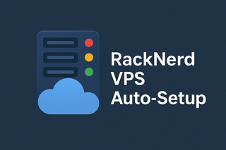

# 🚀 RackNerd VPS 自动化部署工具


一键将全新的 **RackNerd VPS AlmaLinux 8** 配置为功能完整的生产环境，包含 Nginx、SSL、SFTP、Aria2、V2Ray、DDNS 等服务。

---

## ✨ 主要特性

### 🔐 安全加固
- ✅ 自动申请和配置 Let's Encrypt SSL 证书
- ✅ SSH 端口修改 + 防火墙规则
- ✅ SELinux 配置
- ✅ SFTP 用户 chroot 隔离（替代传统 FTP）

### 🌐 Web 服务
- ✅ Nginx 反向代理 + HTTPS 强制跳转
- ✅ 自动证书续期

### 📥 文件传输与下载
- ✅ **SFTP 服务器**（安全文件传输，替代 FTP）
- ✅ Aria2 下载器 + RPC 接口
- ✅ 共享下载目录（Aria2 与 SFTP 互通）

### 🔒 代理服务
- ✅ V2Ray (VMess + WebSocket + TLS)
- ✅ 自动生成客户端配置和订阅链接

### 🌍 动态域名
- ✅ ChangeIP DDNS 自动更新（可选）

### ⚡ 系统优化
- ✅ TCP BBR 拥塞控制
- ✅ 系统依赖自动安装
- ✅ 非 Root 用户运行服务（Aria2、V2Ray）

---

## 📁 项目结构

```
RackNerd-Setup/
├── setup.sh                  # 本地部署入口脚本
├── stage_1.sh                # 阶段 1：系统初始化
├── stage_2.sh                # 阶段 2：服务部署
├── config.ini.example        # 配置文件示例
├── config.ini                # 实际配置文件（需创建）
│
├── lib/
│   ├── env.sh                # 环境变量定义
│   └── utils.sh              # 工具函数（日志、模板替换等）
│
├── modules/                  # 功能模块
│   ├── 01-system.sh          # 系统更新、BBR 启用
│   ├── 02-sftp.sh            # SFTP 服务器配置
│   ├── 03-nginx.sh           # Nginx + SSL 配置
│   ├── 05-aria2.sh           # Aria2 下载器
│   ├── 06-v2ray.sh           # V2Ray 代理
│   ├── 07-ddns.sh            # DDNS 动态域名
│   └── 99-security.sh        # SSH 端口修改
│
└── templates/                # 配置模板
    ├── configs/              # 服务配置文件
    │   ├── nginx.conf        # Nginx 主配置
    │   ├── site.conf         # 站点配置
    │   ├── aria2.conf        # Aria2 配置
    │   ├── v2ray.json        # V2Ray 服务端配置
    │   └── vmess_client.json # V2Ray 客户端配置
    │
    ├── scripts/              # 脚本文件
    │   ├── renew-cert.sh     # SSL 证书续期
    │   └── changeip.sh       # DDNS 更新脚本
    │
    ├── services/             # Systemd 服务单元
    │   ├── aria2.service     # Aria2 服务
    │   └── v2ray.service     # V2Ray 服务
    │
    └── web/                  # 静态网页文件
        └── index.html        # 默认首页
```

---

## 🛠️ 快速开始

### 前置要求

- **VPS 系统**：AlmaLinux 8（RackNerd 默认系统）
- **本地系统**：Linux / macOS / WSL
- **域名**：已解析到 VPS IP 的域名（用于 SSL 证书）
- **本地工具**：bash, ssh, scp, awk, sed

---

### 步骤 1：克隆项目

```bash
git clone https://github.com/holefrog/Racknerd.git
cd Racknerd
```

---

### 步骤 2：生成 SSH 密钥

如果还没有 SSH 密钥：

```bash
mkdir -p rpi_keys
ssh-keygen -t rsa -b 4096 -f rpi_keys/id_rsa -N ""

# 上传公钥到 VPS（替换 YOUR_VPS_IP）
ssh-copy-id -i rpi_keys/id_rsa.pub root@YOUR_VPS_IP
```

---

### 步骤 3：配置文件

```bash
cp config.ini.example config.ini
nano config.ini
```

#### 必须修改的配置项：

```ini
[ssh]
host=YOUR_VPS_IP              # 替换为 VPS IP 地址
user=root
port=22
key=./rpi_keys/id_rsa         # SSH 私钥路径

[nginx]
domain=example.com            # 替换为你的域名
email=admin@example.com       # 替换为你的邮箱

[ftp]
user=ftpuser                  # SFTP 用户名
password=STRONG_PASSWORD_HERE # 设置强密码
path=/var/ftp/files           # 数据目录

[aria2]
token=YOUR_SECRET_TOKEN       # 设置 RPC 密钥

[v2ray]
path_url=ws_random_string     # 随机字符串（WebSocket 路径）
```

#### 可选配置：

```ini
[ports]
ssh_new=22022                 # 修改 SSH 端口（推荐）
aria2=6800
v2ray=10086

[system]
enable_bbr=yes                # 启用 TCP BBR

[ddns]
user=changeip_username        # ChangeIP 用户名
password=changeip_password    # ChangeIP 密码
hostname=your.changeip.com    # ChangeIP 主机名
```

---

### 步骤 4：开始部署

```bash
./setup.sh
```

部署过程：
1. **环境检查** → 验证本地工具和配置文件
2. **上传文件** → VPS
3. **阶段 1**：系统更新、BBR 启用
4. **自动重启**
5. **阶段 2**：安装所有服务
6. **服务检查**
7. **显示部署摘要**

**预计耗时**：10-15 分钟（取决于网络和 VPS 性能）

---

### 步骤 5：验证部署

使用新的 SSH 端口登录：

```bash
ssh -i rpi_keys/id_rsa -p 22022 root@YOUR_VPS_IP
```

检查服务状态：

```bash
systemctl status nginx aria2 v2ray
```

检查端口监听：

```bash
ss -tlnp | grep -E ":(443|6800|10086)"
```

访问网站：

```bash
https://your-domain.com
```

---

## 📋 服务说明

### 1. Nginx（Web 服务器）

- **端口**：80 (HTTP, 自动跳转), 443 (HTTPS)
- **配置文件**：`/etc/nginx/conf.d/YOUR_DOMAIN.conf`
- **站点目录**：`/usr/share/nginx/YOUR_DOMAIN/`
- **SSL 证书**：`/etc/letsencrypt/live/YOUR_DOMAIN/`
- **自动续期**：每月 1 号凌晨自动续期

**管理命令**：
```bash
systemctl restart nginx
nginx -t                    # 测试配置
certbot renew --dry-run     # 测试证书续期
```

---

### 2. SFTP 服务器（替代 FTP）

- **协议**：SFTP over SSH（安全文件传输）
- **端口**：SSH 端口（默认 22 或自定义端口）
- **用户**：config.ini 中配置的 ftp.user
- **目录**：config.ini 中配置的 ftp.path（默认 `/var/ftp/files`）
- **安全特性**：
  - ✅ chroot 限制用户在主目录
  - ✅ 禁止 Shell 登录（仅允许文件传输）
  - ✅ 与 Aria2 共享下载目录（组权限管理）

**连接方式**：

```bash
# 命令行方式
sftp -P 22022 ftpuser@YOUR_VPS_IP

# FileZilla 配置
协议：SFTP
主机：YOUR_VPS_IP
端口：22022（你的 SSH 端口）
用户名：ftpuser
密码：config.ini 中配置的密码
```

**目录结构**：
```
登录后看到的路径：/files
实际路径：/var/ftp/files
```

**权限说明**：
- `/var/ftp` (chroot 根目录) → root:root 755
- `/var/ftp/files` (数据目录) → ftpuser:nginx 775 (SGID)
- Aria2 下载的文件自动继承 nginx 组权限，SFTP 用户可访问

**管理命令**：
```bash
# 修改用户密码
echo "ftpuser:NEW_PASSWORD" | chpasswd

# 查看 SFTP 日志
journalctl -u sshd | grep sftp

# 测试 SSHD 配置
sshd -t
```

---

### 3. Aria2（下载器）

- **端口**：6800 (RPC)
- **配置文件**：`/etc/aria2/aria2.conf`
- **下载目录**：与 SFTP 共享（`/var/ftp/files`）
- **WebUI**：通过 Nginx 反向代理访问
- **运行用户**：nginx（非 Root）

**RPC 连接信息**：
- **地址**：`https://YOUR_DOMAIN/jsonrpc`
- **密钥**：config.ini 中的 `aria2.token`
配置项值协议: HTTPS
RPC 地址:YOUR_DOMAINRPC 
端口:443
RPC 接口路径: /jsonrpcRPC 
密钥:YOUR_SECRET_TOKEN
HTTP Request method: POST

**推荐 WebUI**：
- [AriaNg](https://github.com/mayswind/AriaNg)（推荐）
- [Aria2 WebUI](https://github.com/ziahamza/webui-aria2)

**AriaNg 配置示例**：
```
RPC 地址：https://YOUR_DOMAIN/jsonrpc
RPC 密钥：your_secret_token
```

**管理命令**：
```bash
systemctl restart aria2
tail -f /etc/aria2/aria2.log    # 查看日志
```

---

### 4. V2Ray（代理服务）

- **端口**：10086（可修改）
- **协议**：VMess + WebSocket + TLS
- **路径**：`/YOUR_PATH_URL`（config.ini 中配置）
- **配置文件**：`/etc/v2ray/v2ray.json`
- **运行用户**：nginx（非 Root）

**客户端配置**：

1. **方式一：Base64 订阅链接**
   ```bash
   cat /var/ftp/files/v2ray_sub.txt
   ```
   复制内容，导入到 V2Ray 客户端的订阅功能

2. **方式二：手动配置**
   ```bash
   cat /etc/v2ray/vmess_client.json
   ```

**客户端参数**：
- **地址**：YOUR_DOMAIN
- **端口**：10086（或自定义）
- **UUID**：自动生成（首次部署时显示）
- **传输协议**：ws (WebSocket)
- **路径**：/YOUR_PATH_URL
- **TLS**：启用
- **伪装域名**：YOUR_DOMAIN

**管理命令**：
```bash
systemctl restart v2ray
journalctl -u v2ray -f          # 查看日志
cat /etc/v2ray/v2ray.json       # 查看服务端配置
```

---

### 5. DDNS（动态域名，可选）

- **服务商**：ChangeIP.com
- **更新频率**：每 15 分钟
- **日志**：`/var/log/changeip.log`

**启用方式**：
在 `config.ini` 中配置 `[ddns]` 部分即可自动启用

**手动运行**：
```bash
/usr/local/bin/changeip.sh
```

**查看日志**：
```bash
tail -f /var/log/changeip.log
```

**日志内容示例**：
```
--------------------------------------------------------------------
Thu Nov 20 10:30:01 UTC 2025
IP no change: 192.0.2.1
```

---

## 🔧 常见问题

### Q1: SSL 证书申请失败？

**原因**：
1. 域名 DNS 未解析到 VPS IP
2. 防火墙未开放 80/443 端口
3. Nginx 未正确安装

**解决方法**：
```bash
# 检查 DNS 解析
dig YOUR_DOMAIN +short

# 检查防火墙
firewall-cmd --list-all

# 手动申请证书
certbot certonly --nginx -d YOUR_DOMAIN --email YOUR_EMAIL --agree-tos
```

---

### Q2: 服务无法启动？

```bash
# 查看服务状态
systemctl status SERVICE_NAME

# 查看详细日志
journalctl -xeu SERVICE_NAME

# 重启服务
systemctl restart SERVICE_NAME
```

---

### Q3: SSH 连接断开？

如果修改了 SSH 端口，立即使用新端口登录：

```bash
ssh -i rpi_keys/id_rsa -p 22022 root@YOUR_VPS_IP
```

如果无法连接，联系 RackNerd 客服通过 VNC 恢复。

---

### Q4: V2Ray 客户端无法连接？

**检查清单**：
1. UUID 是否正确（查看 `/etc/v2ray/v2ray.json`）
2. WebSocket 路径是否匹配
3. 端口是否开放
4. TLS 是否启用
5. 证书是否有效

```bash
# 查看 V2Ray 配置
cat /etc/v2ray/v2ray.json

# 查看客户端配置
cat /etc/v2ray/vmess_client.json

# 测试端口
nc -zv localhost 10086

# 查看 V2Ray 日志
journalctl -u v2ray -f
```

---

### Q5: SFTP 无法连接？

```bash
# 检查 SSH 服务
systemctl status sshd

# 测试 SSHD 配置
sshd -t

# 查看 SFTP 日志
journalctl -u sshd | grep sftp

# 检查用户和权限
id ftpuser
ls -la /var/ftp/
```

**常见错误**：
- **连接被拒绝**：检查 SSH 端口是否正确
- **密码错误**：重置密码 `echo "ftpuser:NEW_PASSWORD" | chpasswd`
- **无法写入文件**：检查 `/var/ftp/files` 权限

---

### Q6: Aria2 下载的文件无法通过 SFTP 访问？

这是权限问题，已在部署脚本中通过 SGID 位解决：

```bash
# 检查目录权限
ls -la /var/ftp/

# 应该看到类似输出：
# drwxrwsr-x 2 ftpuser nginx 4096 Nov 20 10:00 files

# 如果权限不对，手动修复：
chown ftpuser:nginx /var/ftp/files
chmod 2775 /var/ftp/files  # 2 = SGID
```

---

## 🔐 安全建议

### 1. 定期更新系统
```bash
dnf update -y
```

### 2. 更改默认端口
在 `config.ini` 中修改：
```ini
[ports]
ssh_new=自定义端口（推荐 10000-65535）
aria2=自定义端口
v2ray=自定义端口
```

### 3. 使用强密码
- SFTP 密码至少 16 位，包含大小写字母、数字、特殊字符
- Aria2 token 使用随机字符串（建议 32 位以上）
- V2Ray path_url 使用随机字符串

**生成强密码**：
```bash
# 生成 32 位随机密码
openssl rand -base64 32

# 生成随机字符串（用于 V2Ray 路径）
cat /dev/urandom | tr -dc 'a-zA-Z0-9' | fold -w 16 | head -n 1
```

### 4. 限制访问（可选）

如果需要限制某些服务的访问来源，编辑 Nginx 配置：

```nginx
# 限制 Aria2 RPC 访问
location /jsonrpc {
    allow YOUR_HOME_IP;
    deny all;
    proxy_pass http://localhost:6800/jsonrpc;
}
```

### 5. 监控日志
```bash
# 失败登录
lastb -n 20

# 系统日志
journalctl -p err -n 50

# Nginx 访问日志
tail -f /var/log/nginx/access.log

# SFTP 日志
journalctl -u sshd | grep sftp | tail -n 20
```

### 6. 防火墙规则优化

```bash
# 仅允许特定 IP 访问 SSH（可选）
firewall-cmd --permanent --add-rich-rule='rule family="ipv4" source address="YOUR_HOME_IP" port port="22022" protocol="tcp" accept'
firewall-cmd --reload
```

---

## 📚 目录和文件位置

| 服务 | 配置文件 | 日志文件 | 数据目录 |
|------|---------|---------|---------|
| Nginx | `/etc/nginx/conf.d/` | `/var/log/nginx/` | `/usr/share/nginx/DOMAIN/` |
| SFTP | `/etc/ssh/sshd_config` | `journalctl -u sshd` | `/var/ftp/files/` |
| Aria2 | `/etc/aria2/aria2.conf` | `/etc/aria2/aria2.log` | `/var/ftp/files/` |
| V2Ray | `/etc/v2ray/v2ray.json` | `/etc/v2ray/*.log` | - |
| SSL | `/etc/letsencrypt/live/` | `/var/log/letsencrypt/` | - |
| DDNS | `/usr/local/bin/changeip.sh` | `/var/log/changeip.log` | - |

---

## 🚀 高级用法

### 添加新域名

1. 申请新证书：
```bash
certbot certonly --nginx -d new-domain.com --email your@email.com
```

2. 复制站点配置：
```bash
cp /etc/nginx/conf.d/old-domain.conf /etc/nginx/conf.d/new-domain.conf
```

3. 修改配置中的域名和证书路径

4. 重载 Nginx：
```bash
nginx -t && systemctl reload nginx
```

---

### 添加新模块

1. 在 `modules/` 目录创建新脚本（例如 `08-mysql.sh`）
2. 在 `stage_2.sh` 中添加：
```bash
bash modules/08-mysql.sh
```

---

### 备份重要数据

**推荐备份内容**：
```bash
# 创建备份目录
mkdir -p /root/backup

# 备份配置文件
tar -czf /root/backup/configs-$(date +%Y%m%d).tar.gz \
    /etc/nginx/conf.d/ \
    /etc/aria2/ \
    /etc/v2ray/ \
    /etc/ssh/sshd_config

# 备份 SSL 证书
tar -czf /root/backup/ssl-$(date +%Y%m%d).tar.gz \
    /etc/letsencrypt/

# 备份数据文件
tar -czf /root/backup/data-$(date +%Y%m%d).tar.gz \
    /var/ftp/files/
```

**定期备份脚本**（可选）：
```bash
cat > /usr/local/bin/backup.sh << 'EOF'
#!/bin/bash
BACKUP_DIR="/root/backup"
DATE=$(date +%Y%m%d-%H%M)
mkdir -p "$BACKUP_DIR"

# 备份配置
tar -czf "$BACKUP_DIR/config-$DATE.tar.gz" \
    /etc/nginx/conf.d/ \
    /etc/aria2/ \
    /etc/v2ray/ \
    /etc/ssh/sshd_config

# 删除 30 天前的备份
find "$BACKUP_DIR" -name "config-*.tar.gz" -mtime +30 -delete

echo "[$(date)] Backup completed" >> /var/log/backup.log
EOF

chmod +x /usr/local/bin/backup.sh

# 添加到 cron（每天凌晨 2 点）
echo "0 2 * * * root /usr/local/bin/backup.sh" > /etc/cron.d/backup
```

---

## 🤝 贡献

欢迎提交 Issue 和 Pull Request！

1. Fork 本项目
2. 创建特性分支 (`git checkout -b feature/AmazingFeature`)
3. 提交更改 (`git commit -m 'Add some AmazingFeature'`)
4. 推送到分支 (`git push origin feature/AmazingFeature`)
5. 开启 Pull Request

---

## 📜 开源许可

MIT License - 详见 [LICENSE](LICENSE) 文件

---

## 📞 支持

- **GitHub Issues**: [https://github.com/holefrog/Racknerd/issues](https://github.com/holefrog/Racknerd/issues)
- **文档**: [项目 Wiki](https://github.com/holefrog/Racknerd/wiki)

---

## 🙏 致谢

- [Nginx](https://nginx.org/)
- [V2Ray](https://www.v2fly.org/)
- [Aria2](https://aria2.github.io/)
- [Let's Encrypt](https://letsencrypt.org/)
- [RackNerd](https://www.racknerd.com/)
- [ChangeIP](https://www.changeip.com/)

---

## ⚠️ 免责声明

本项目仅供学习和个人使用。使用本工具部署的服务，请遵守当地法律法规和 VPS 服务商的使用条款。作者不对因使用本工具导致的任何问题负责。

---

## 📝 更新日志

### v2.0.0 (2025-11-20)
- ✨ 用 SFTP 替代传统 FTP（更安全）
- ✨ 新增 ChangeIP DDNS 支持
- ✨ 移除 Node.js 服务（简化架构）
- 🔒 Aria2 和 V2Ray 使用非 Root 用户运行
- 🔒 增强权限管理（SGID 位）
- 📝 完善部署前环境检查
- 🐛 修复模板变量替换中的特殊字符问题

### v1.0.0 (2024-11-20)
- 🎉 初始版本发布

---

**最后更新**: 2025-11-20
